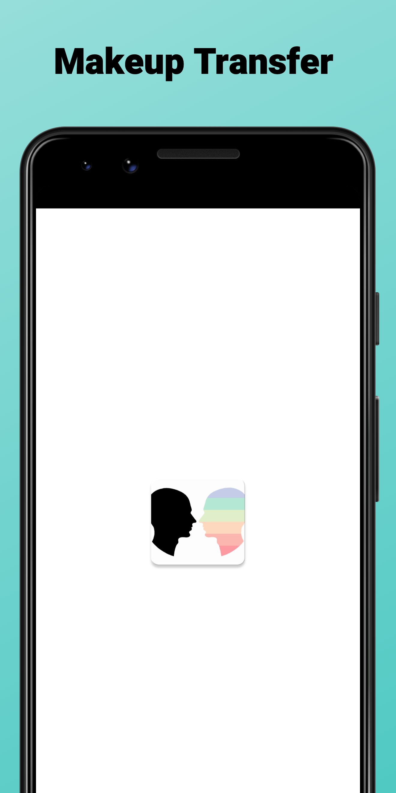
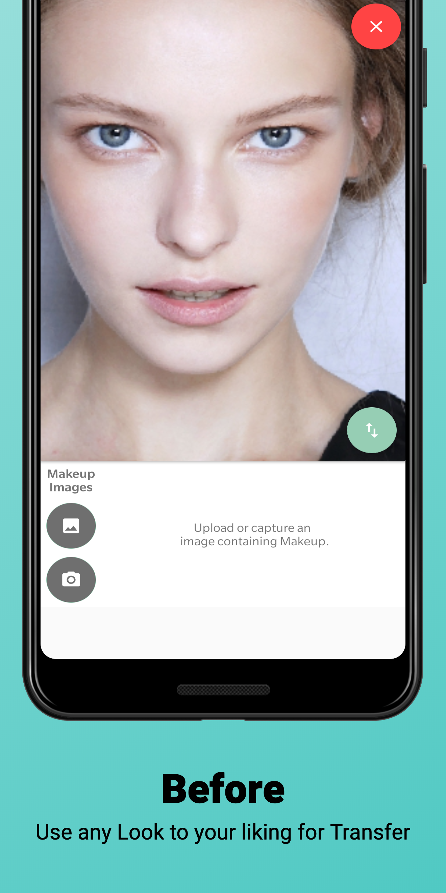
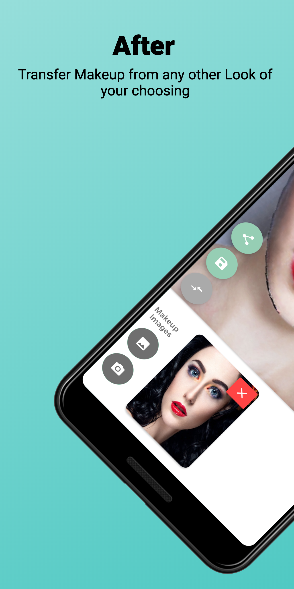
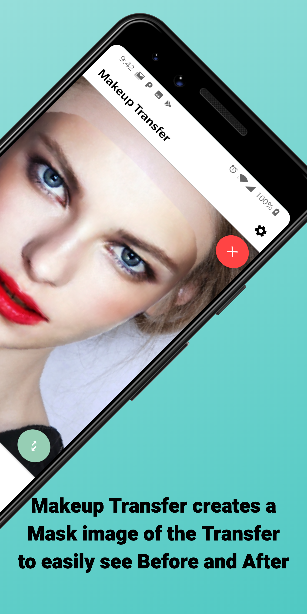
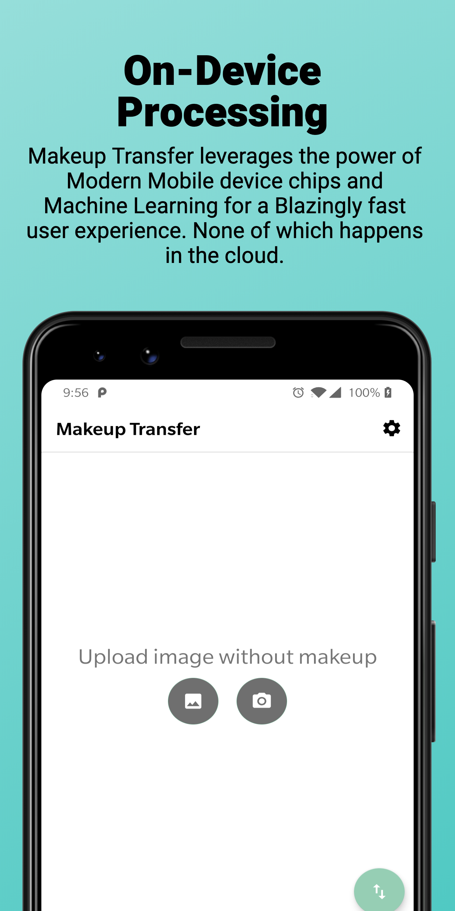
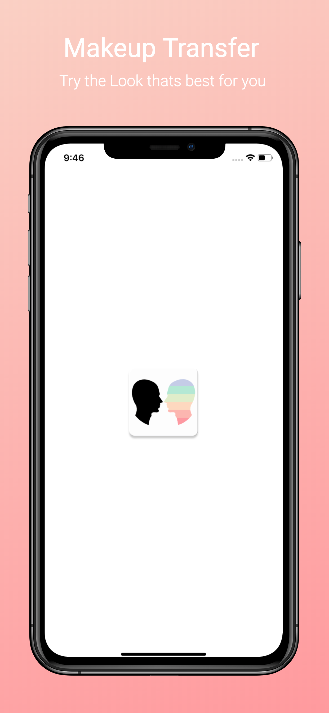
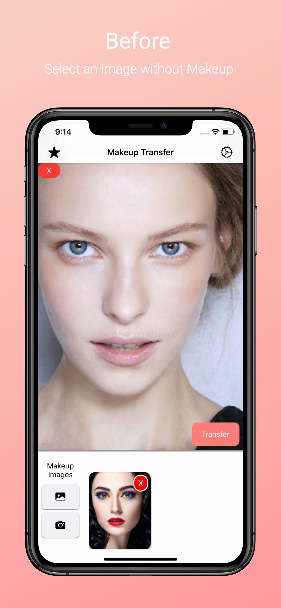
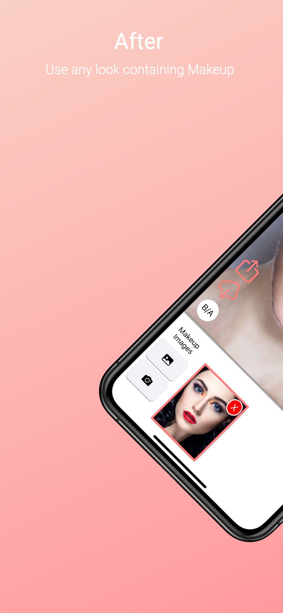
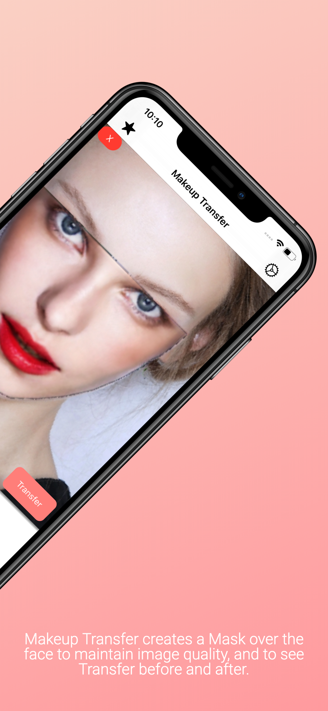
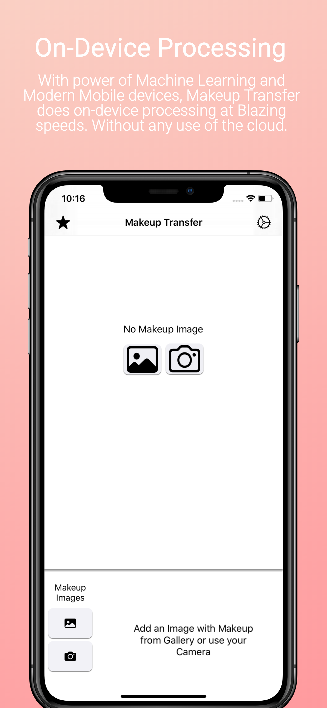

# Makeup Transfer for Android

Makeup Transfer is a simple Android app for transferring Makeup from one face to another. 

_Video Demo: https://www.youtube.com/watch?v=Al0bOkuRDbo_

<!-- <a href="https://f-droid.org/app/org.horaapps.leafpic">
     -->
</a>

  

## Screenshots

#### _Android_

    
    
    
    
    

#### _iOS_

    
    
    
    
    

